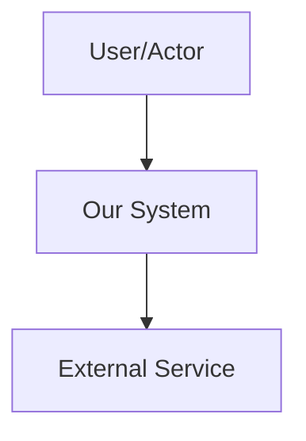
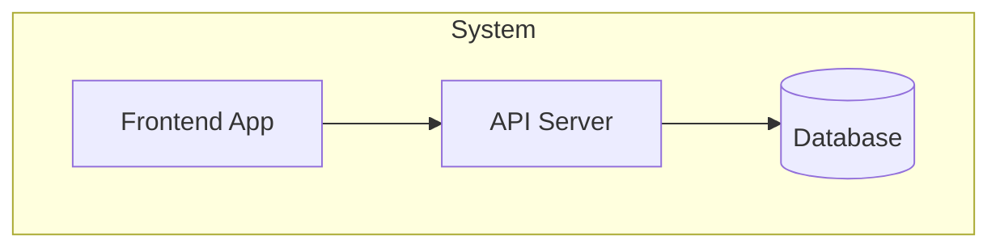
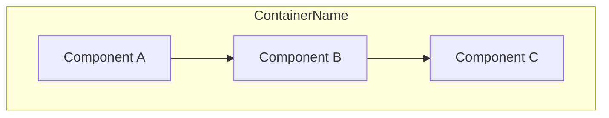

# Architecture

## System Context (C4 Level 1)
<!-- Who uses the system and what external systems does it interact with? -->



## Containers (C4 Level 2)
<!-- What are the major deployable units? (frontend, backend, database, etc.) -->



## Components (C4 Level 3)
<!-- For each container, what are the major structural pieces? -->

### [Container Name]



## Infrastructure
<!-- How is this deployed? -->

```
[Describe hosting, CI/CD, environments]
```

## Key Constraints
<!-- Technical constraints, budget, timeline, team size -->
