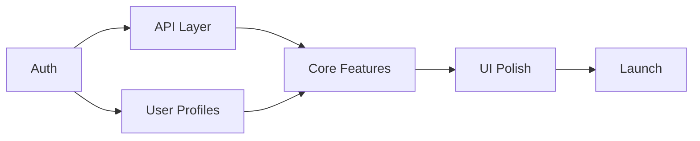

# Build Plan

## Milestones

### M1: [Name] — Foundation
**Goal:** [What's working at the end of this milestone]
- [ ] Task 1
- [ ] Task 2
- [ ] Task 3

### M2: [Name] — Core Features
**Goal:**
- [ ] Task 1
- [ ] Task 2

### M3: [Name] — Polish & Launch
**Goal:**
- [ ] Task 1
- [ ] Task 2

## Dependencies
<!-- What must be built before what? -->

## Risks
<!-- What could block or delay us? -->
| Risk | Impact | Mitigation |
|------|--------|------------|
| | | |
