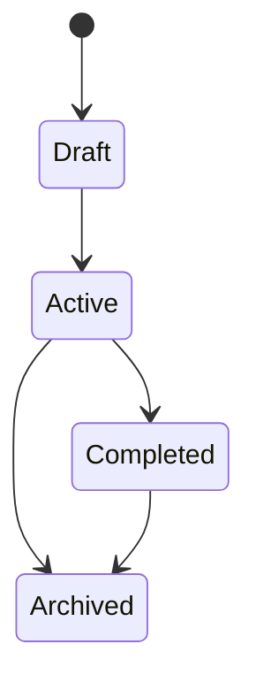

# Data Model

## Entities & Schemas

### [EntityName]
```
EntityName {
  id          : unique identifier
  name        : string, required
  created_at  : timestamp
  updated_at  : timestamp
}
```

## Relationships
```
User HAS MANY Projects
Project HAS MANY Tasks
Task BELONGS TO Project
Task HAS ONE Assignee (User)
```

## Indexes & Query Patterns
<!-- What queries will be common? Design data access around these. -->
- List all [X] by [Y]
- Find [X] where [condition]
- Aggregate [X] grouped by [Y]

## State Machines
<!-- If entities have lifecycle states, map them -->


