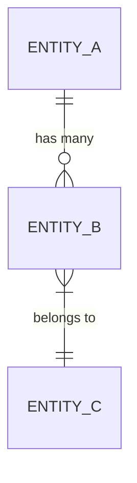

# Domain Model

## Ubiquitous Language
<!-- Key terms and their precise meanings in this project -->

| Term | Definition |
|------|-----------|
| | |

## Entities
<!-- Core objects in the system -->

### [EntityName]
- **Description:**
- **Key attributes:**
- **Behaviors:**
- **Relationships:**

## Relationships

## Bounded Contexts
<!-- If the system is complex, identify separate domains -->

### [Context Name]
- **Responsibility:**
- **Entities owned:**
- **Interfaces with:**
