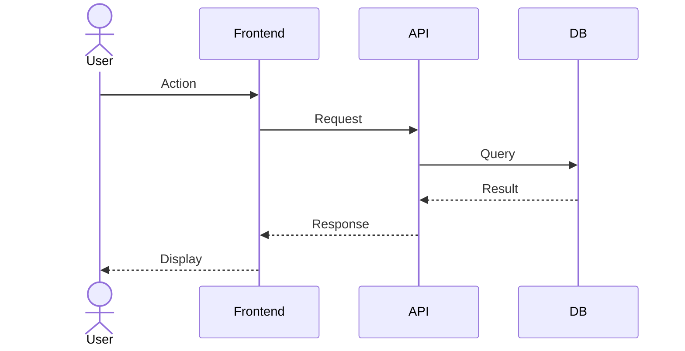

# Flows & Logic

## User Flows

### [Flow Name]
**Trigger:** [What initiates this flow]
**Actor:** [Who performs it]

**Steps:**
```
1. User does X
2. System validates Y
3. IF condition THEN
     System does A
   ELSE
     System does B
4. System returns result to User
```

**Sequence Diagram:**


## Business Rules
<!-- Logic that governs the system -->
- Rule 1: [Description]
- Rule 2: [Description]

## Edge Cases
<!-- What could go wrong? What are the boundary conditions? -->
- [ ] What happens when...
- [ ] What if the user...
