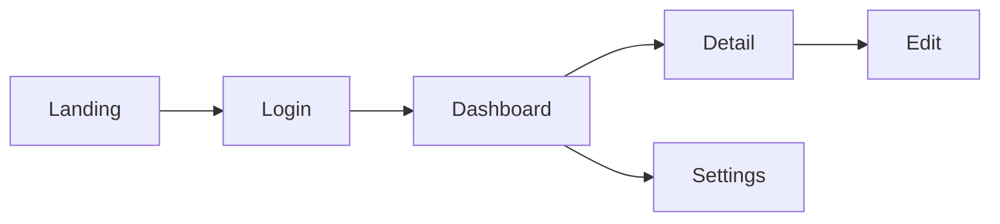

# UI Design

## Screen Map
<!-- High-level navigation structure -->



## Screens

### [Screen Name]
**Purpose:** [What the user accomplishes here]
**Route:** `/path`

**Layout:**
```
+----------------------------------+
|  Header / Nav                    |
+----------------------------------+
|  Sidebar  |  Main Content        |
|           |                      |
|  - Nav 1  |  [Component A]      |
|  - Nav 2  |  [Component B]      |
|  - Nav 3  |                      |
+----------------------------------+
|  Footer                          |
+----------------------------------+
```

**Components:**
- **Component A** — [what it does, key interactions]
- **Component B** — [what it does, key interactions]

**State:**
- Loading: [what shows while loading]
- Empty: [what shows when no data]
- Error: [what shows on failure]

## Component Hierarchy
```
App
  Layout
    Header
      Logo
      NavMenu
      UserMenu
    Sidebar
    MainContent
      [Page-specific components]
    Footer
```
